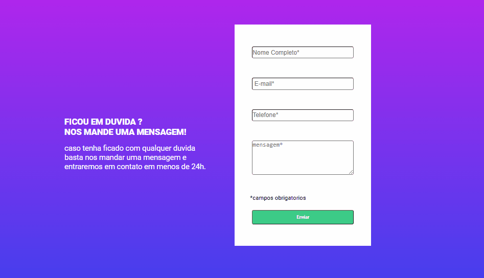

# Projeto 

## Sobre

Este projeto é um formulário de validação desenvolvido como parte do curso da DevQuest. O objetivo é criar um formulário que valide corretamente os dados inseridos pelos usuários, garantindo que todos os campos obrigatórios sejam preenchidos antes do envio.  
Durante o desenvolvimento, enfrentei alguns desafios, especialmente em relação à exibição de mensagens de erro quando campos obrigatórios são deixados em branco. Essas mensagens são importantes para guiar o usuário e garantir que os dados sejam fornecidos de forma completa e correta. 
Este projeto me ajudou a entender melhor como funciona a validação de formulários, e como é possível manipular mensagens de erro para uma experiência de usuário mais intuitiva e clara. 

## Funcionalidades

- Validação de campos obrigatórios
- Exibição de mensagens de erro em tempo real
- Orientação ao usuário para corrigir informações ausentes ou incorretas

## Aprendizados
Ao trabalhar nesse projeto, aprendi a lidar com validações de campo em JavaScript/HTML e a melhorar a interação com o usuário através de mensagens de erro amigáveis. Esse aprendizado é fundamental para qualquer desenvolvedor web, pois garante a criação de formulários funcionais e profissionais.

## tecnologias usadas

 